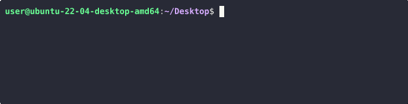

# Rootkit Signal Hunter

Some rootkits install signal handlers which listen for specific signals to elevate privileges.
This tool can identify these rootkits by sending signals and observing UID switching to root.
Optionally spawns a root shell.

<p align="center">
  
</p>

Tested with:

* [Singularity](https://github.com/MatheuZSecurity/Singularity) 5b6c4b6 (2025-10-19) on Ubuntu 24.04 kernel 6.8.0-31-generic (x64)
* [Diamorphine](https://github.com/m0nad/Diamorphine) 2337293 (2023-09-20) on Ubuntu 22.04 kernel 5.19.0-38-generic (x64)
* [KoviD](https://github.com/carloslack/KoviD) 9b67e46 (2025-10-14) on Ubuntu 24.04 kernel 6.8.0-31-generic (x64)
  * (successful detection requires knowledge of hardcoded target PID `666`)

## Build

```sh
cargo build --release
```

## Usage

```sh
rootkit-signal-hunter -- [OPTIONS]
```

## Options

- `--min <MIN>`: Minimum signal number (default: `0`)
- `--max <MAX>`: Maximum signal number (default: `64`)
- `-s`, `--shell`: Launch a root shell (if detected)
- `-t`, `--threads`: Number of worker threads (default: `16`)
- `-p`, `--pid`: Process ID to send signals to (default: `$$`)
- `-v`, `--verbose`: Enable verbose output

## Example

Rootkits such as [Singularity](https://github.com/MatheuZSecurity/Singularity)
and [Diamorphine](https://github.com/m0nad/Diamorphine) allow privilege
escalation using any process ID and can be trivially detected with default options
(`-s` spawns a root shell):

```sh
rootkit-signal-hunter -s
```

Rootkits such as [KoviD](https://github.com/carloslack/KoviD) require a specific
process ID to be provided with the `-p` / `--pid` flag:

```sh
rootkit-signal-hunter -s --pid 666
```

Note: this risks terminating the legitimate process with ID `666`
(if the current user has the necessary permission).

## Credit

Author: bcoles

Shoutout to David Reguera Garcia (Dreg) who had the same idea and implemented
similar functionality as part of [lsrootkit](https://github.com/therealdreg).
